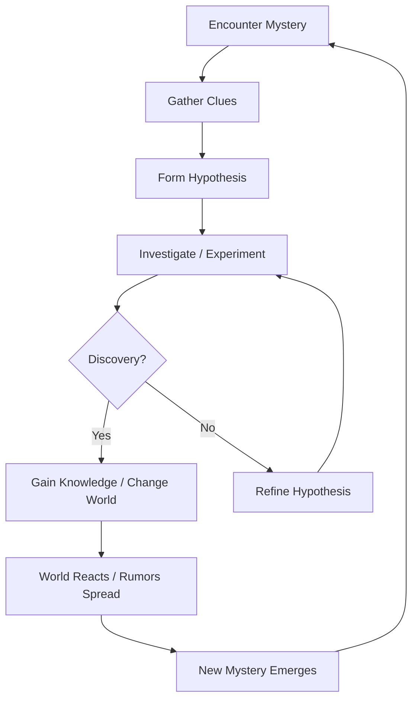

# Core Game Loop: The Cycle of Discovery

## Overview
This document defines the fundamental heartbeat of the game. Unlike traditional RPGs where the loop is `Accept Quest → Kill Monster → Get Loot → Turn In`, our loop is driven by **curiosity, investigation, and consequence**.

The goal is to create a self-reinforcing cycle where every answer generates new questions, and every action ripples through the living world.

---

## The Primary Loop (The "Wonder Cycle")

### Stage 1: Encounter Mystery (The Hook)
The player encounters something unknown. This is **never** marked with a quest marker.
- **Sources**: 
  - Environmental anomaly (e.g., a river flowing uphill).
  - NPC Rumor (e.g., "The blacksmith hasn't been seen since the blood moon").
  - Found Item (e.g., a diary page with a cipher).
  - Visual Cue (e.g., a strange light in a forbidden forest).
- **Design Rule**: The mystery must be observable but unexplained.

### Stage 2: Gather Clues (The Investigation)
The player actively seeks information.
- **Actions**:
  - Talking to specific NPCs (who may lie or know only fragments).
  - Reading books/scrolls (requiring language skills).
  - Observing patterns (weather, monster migrations, NPC schedules).
  - Using Role Abilities (e.g., Wizard sensing magic residues).
- **Design Rule**: Clues are fragmented. No single source gives the full answer.

### Stage 3: Form Hypothesis (The Deduction)
The player mentally (or via Journal) connects the dots.
- **Player Thought Process**: "If the river flows uphill only at night, and the Wizard sensed magic near the ruins... maybe the ruins activate at night?"
- **System Support**: The Player Journal automatically organizes clues but **does not** solve the puzzle for them.

### Stage 4: Investigate / Experiment (The Action)
The player tests their theory in the world.
- **Risk**: Failure is possible. The hypothesis might be wrong, leading to danger, wasted resources, or missed opportunities.
- **Action Examples**:
  - Visiting the ruins at midnight.
  - Bringing a specific item to an NPC.
  - Casting a specific spell on an object.

### Stage 5: Discovery & Consequence (The Payoff)
The outcome of the experiment.
- **Success**: 
  - **Knowledge Gained**: Unlocking a map, learning a language, understanding a mechanic.
  - **World Change**: A door opens, an NPC is saved, a faction relationship shifts.
  - **Reward**: Often intangible (access, trust, story progression) rather than just loot.
- **Failure**: 
  - **New Complication**: The situation worsens (e.g., the NPC dies, the monster migrates).
  - **Lesson Learned**: The player gains a clue about what *doesn't* work.

### Stage 6: World Reaction & Propagation (The Ripple)
The world acknowledges the event.
- **Immediate**: NPCs react, weather changes, items appear/disappear.
- **Propagation**: News spreads slowly via travelers, bards, and merchants. Other players may hear rumors days later.
- **Legacy**: The event is recorded in the world history (e.g., "The Night the River Reversed").

### Stage 7: New Mystery Emerges (The Hook Renewed)
Every answer unlocks deeper questions.
- **Example**: Opening the ancient door reveals not treasure, but a warning about a sleeping entity. Now the mystery is "What happens if it wakes?"

---

## Secondary Loops

### The Social Loop (Community)
1. **Player A** discovers a secret.
2. **Player A** shares a vague rumor or sells a map.
3. **Player B** hears the rumor and investigates.
4. **Player B** verifies or debunks the claim.
5. **Community Consensus** forms (which may be right or wrong).

### The Legacy Loop (Long-Term)
1. **Player** performs significant actions over time.
2. **World** silently tracks these actions (Invisible Counters).
3. **Trigger Condition** met (e.g., "Saved 50 travelers").
4. **Legacy Scenario** activates unexpectedly.
5. **Permanent Change** occurs in the world state.

---

## Design Principles for the Loop

1. **No Markers**: Never tell the player exactly where to go. Use environmental storytelling and rumors.
2. **Fragmented Truth**: No single NPC or book knows everything. Truth must be synthesized.
3. **Failure is Narrative**: Failing an investigation should create a new story branch, not a "Game Over."
4. **Time Matters**: Some mysteries only resolve after days/weeks of in-game time.
5. **Knowledge > Loot**: The primary reward for completing the loop should be information or access, not just gear.

---

## Example Walkthrough

**Scenario: The Missing Blacksmith**

1. **Encounter**: Player visits a village. The forge is cold. Villagers whisper about the blacksmith vanishing during the last storm.
2. **Gather Clues**: 
   - Player finds muddy footprints leading to the swamp (Herbalist role identifies rare swamp moss).
   - Player hears a rumor at the tavern about "lights in the swamp."
   - Player finds a dropped hammer near the swamp edge with strange runes.
3. **Hypothesis**: The blacksmith didn't run away; he was drawn to something in the swamp, possibly related to the runes.
4. **Investigate**: Player travels to the swamp at night (when lights were seen). Uses water-breathing potion (crafting).
5. **Discovery**: Finds the blacksmith trapped in an ancient ruin underwater. He was lured by a siren spirit seeking repair for her broken crown.
6. **Consequence**: 
   - **Choice**: Repair crown (gain spirit ally) OR Kill spirit (save blacksmith immediately).
   - **Outcome**: Player chooses to repair. Spirit vanishes, leaving a blueprint for "Spirit Steel." Blacksmith returns but is traumatized.
7. **Reaction**: Village forge reopens. Prices drop. Blacksmith sells "Spirit Steel" items only to this player initially. Rumors spread to neighboring towns about the "Ghost Forge."
8. **New Mystery**: The blueprint mentions "The Crown belonged to the Drowned King." Where is his tomb?

---

## Metrics for Success (The "Wonder Metric")

We measure success not by "Quests Completed," but by:
- **Hypotheses Formed**: How often do players stop to think?
- **Rumors Followed**: How many players act on unverified information?
- **False Leads**: How many players pursued a dead end? (High number = good mystery design).
- **Community Debate**: Are players arguing about theories on Discord/Reddit?
- **Emergent Stories**: Are players sharing "You won't believe what happened" stories?
